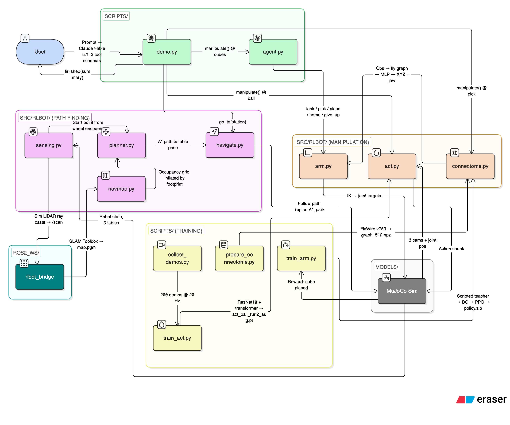

# RL-BOT

A two-wheeled robot that cleans a room. It is built and tested in simulation.

The robot is the **BracketBot**: a self-balancing base, a tall mast, and two
7-joint arms with grippers. It runs inside **MuJoCo**. One prompt drives the
whole job: an agent plans, the robot drives to a table, and a task-specific
controller does the manipulation.

To see it without installing anything, watch [`demo/tour.mov`](demo/tour.mov):
the whole job in one continuous simulation, 7 min 48 s. [`demo/`](demo/) also
holds a close-up of ACT, the scripted pick-and-place baseline, and the
fly-brain point-goal pilot.

## Demo

<div align="center">
  <a href="https://www.youtube.com/watch?v=WjJpOjjXQZs">
    
  </a>
  <br/>
  <strong>Click the image above to watch the demo on YouTube</strong>
  <br/>
  <strong><a href="https://devpost.com/software/mr-clean">Check out our Devpost!</a></strong>
</div>

## Contents

1. [Quick start](#quick-start)
2. [System overview](#system-overview)
3. [Simulation](#simulation)
4. [Path finding](#path-finding)
5. [Agent](#agent)
6. [ACT](#act)
7. [Fly brain](#fly-brain)
8. [Verification](#verification)
9. [Folder layout](#folder-layout)
10. [Assumptions](#assumptions)

In-depth notes on each part are in [docs/theory.md](docs/theory.md).

## Quick start

You need macOS (Apple Silicon works) and Python 3.10 or newer.

```bash
python3.12 -m venv .venv
source .venv/bin/activate
pip install -r requirements.txt          # MuJoCo and NumPy
pip install -r requirements-agent.txt    # Anthropic SDK, for the Fable agent
pip install -r requirements-rl.txt       # torch, gymnasium, SB3, for ACT and the fly brain
```

On Windows, replace `.venv/bin/python` with `.venv\Scripts\python.exe`.

Run the full tour headless. The robot tidies the cubes, drives on, picks the
blue cube, drives to the ball table, and tries the ball. It takes a few
minutes.

```bash
.venv/bin/python scripts/demo.py --planner sweep "clean the cubes, then pick up the blue cube, then go to the ACT table"
```

Watch it. Use `mjpython`, not `python`, for any window on macOS.

```bash
.venv/bin/mjpython scripts/demo.py --view --speed 2 --planner sweep "go to the ACT table"
```

Let Claude decide the calls. This needs an API key.

```bash
export ANTHROPIC_API_KEY=sk-ant-...
.venv/bin/python scripts/demo.py "tidy the cubes table, then go to the ACT station"
```

With no prompt, `demo.py` opens a `> ` loop. The robot stays where the last
prompt left it. The exit code is 0 only when every tool call succeeds.

Record a run instead of watching it. `--video` renders over the robot's
shoulder at 30 fps and pipes to `ffmpeg`; it runs headless.

```bash
.venv/bin/python scripts/demo.py --planner sweep --video out/tour.mov "clean the cubes, then pick up the blue cube, then go to the ACT table"
```

## System overview



The diagram shows the five parts of the system and the files that own them.
Boxes are files. Arrows are the calls and the data between them. The source
is `docs/architecture.eraser` (eraser.io).

| Part | Files | Job |
| --- | --- | --- |
| Agent | `scripts/demo.py`, `scripts/agent.py` | Turn the prompt into tool calls |
| Path finding | `src/rlbot/sensing.py`, `navmap.py`, `planner.py`, `navigate.py`, `ros2_ws/` | Sense, map, plan, drive, park |
| Manipulation | `src/rlbot/arm.py`, `act.py`, `connectome.py` | Move the arms at each table |
| Simulation | `models/`, MuJoCo | Physics for the robot, the room, and the sensors |
| Training | `scripts/collect_demos.py`, `train_act.py`, `prepare_connectome.py`, `train_arm.py` | Make the ACT and fly-brain checkpoints |

`scripts/demo.py` runs everything in **one** MuJoCo model. A prompt becomes
tool calls from a top-level agent. The agent has three tools.

```
prompt  "clean the cubes, then pick up the blue cube, then go to the ACT table"
│
└── top-level agent ─────────── Claude Fable 5.1, or keyword routing with --planner sweep
    │                           scripts/demo.py · TOP_TOOLS
    │
    ├── go_to(station) ───────── src/rlbot/live.py → src/rlbot/navigate.py
    │   ├── plan                 A* on the inflated room grid        planner.py · navmap.py
    │   ├── drive                exit → turn → curve → dock, replan between phases
    │   └── park                 weld chassis to world (data.eq_active), impratio 200
    │
    ├── manipulate() ─────────── dispatches on the table the robot is parked at
    │   ├── cubes                Fable skills agent, nested          scripts/agent.py · skills.py
    │   │   └── look · pick · place · home · give_up · finished
    │   ├── pick                 fly-brain arm policy                live_arm.py · connectome.py
    │   └── ball                 ACT, one closed-loop episode        act.py
    │
    └── finished(summary) ────── stop
```

`manipulate` dispatches on the station:

| Station | Objects | Controller | Code |
| --- | --- | --- | --- |
| `cubes` | four colored cubes and a crate | Fable skills agent, nested inside the top-level agent | `scripts/agent.py`, `src/rlbot/skills.py` |
| `pick` | one blue cube and a rectangle | Fly-brain policy | `src/rlbot/live_arm.py`, `src/rlbot/connectome.py` |
| `ball` | a red ball and a box | ACT | `src/rlbot/act.py` |

There is no fallback controller. When a table's controller is unavailable, the
tool result says so and the agent decides what to do next.

On arrival the robot does not jump to a keyframe. A pre-declared weld between
the chassis and the world is switched on (`data.eq_active`). The base holds
still like a parking brake. The solver impedance ratio is raised to 200 for
the pinch. Both are switched back before the next drive. The code is
`src/rlbot/live.py`.

Each table's controller was tuned on different contact pads. The live room
carries one pad per blade and rewrites it on arrival (`LiveSim.use_pads`).

## Simulation

The robot is the BracketBot URDF from Onshape. `scripts/build_mjcf.py`
converts it to MuJoCo and adds what the URDF lacks: wheel joints, floor
contact, mass, joint limits, a mimic gripper, and contact pads on the
fingers. A hand-tuned PD controller balances the robot at 500 Hz.
`scripts/build_room.py` writes a 6.0 x 4.5 m room with three tables.
`src/rlbot/room.py` says what is on each table and where.

The robot has no real sensors. Every input is computed from the MuJoCo state
at a real sensor's rate:

| Sensor | How it is simulated |
| --- | --- |
| Wheel encoders | The angle and speed of each wheel hinge joint |
| IMU | MuJoCo gyro, accelerometer, and orientation sensors on an `imu` site |
| Lidar | Rays cast by hand from the `lidar` site at 10 Hz, 72 or 360 beams |
| Cameras | Head and wrist cameras rendered offscreen at 224 px |
| Odometry | Dead reckoning from the wheel angles and the gyro |

In depth: [Simulation](docs/theory.md#simulation) and
[How the sensors are simulated](docs/theory.md#how-the-sensors-are-simulated)
in `docs/theory.md`.

## Path finding

1. SLAM Toolbox in ROS 2 Jazzy, inside Docker, builds the map from the
   simulated lidar and odometry (`ros2_ws/src/rlbot_bridge/`).
2. `src/rlbot/navmap.py` turns the map into an occupancy grid and inflates
   every obstacle by the robot's footprint.
3. `src/rlbot/planner.py` runs A* to a predefined docking pose, then fits a
   spline and a speed schedule.
4. `src/rlbot/navigate.py` drives the route in phases. Between phases it
   stops, reads the pose, and replans from where it is.

All nine routes between the start pose and the three tables arrive within
10 cm and 5 degrees, with no falls and no furniture contact. In the demo the
pose comes from the simulator. The ROS `navigate` node runs the same
navigator on the SLAM pose.

In depth: [Path finding](docs/theory.md#path-finding) in `docs/theory.md`.

## Agent

Claude Fable 5.1 (`scripts/agent.py`) receives three tools from
`scripts/demo.py`: `go_to`, `manipulate`, and `finished`. `--planner sweep`
replaces the model with keyword routing over the same tools, so the demo
runs without an API key.

At the cubes table, `manipulate` starts a nested skills agent with six
skills: `look`, `pick`, `place`, `home`, `give_up`, and `finished`
(`src/rlbot/skills.py`). The model sequences the skills. The code chooses
the arm, retries wrist angles, and enforces the step budget.

In depth: [Agent](docs/theory.md#agent) in `docs/theory.md`.

## ACT

`src/rlbot/act.py` is our implementation of ACT, sized for a laptop: one
ResNet-18 shared across three cameras, a 4+4 layer transformer, 16-number
state and action, and 32-step action chunks at 20 Hz. Demonstrations come
from keyboard teleop (`scripts/teleop.py`) or the scripted collector
(`scripts/collect_demos.py`). `scripts/train_act.py` trains on the ball
table. The shipped checkpoint reaches and closes on the ball about four
times in ten, then loses it on the carry.

In depth: [ACT](docs/theory.md#act) in `docs/theory.md`.

## Fly brain

`src/rlbot/connectome.py` routes robot observations through a 512-neuron
graph cut from the FlyWire FAFB v783 fruit-fly connectome, then through a
Stable-Baselines3 MLP head. The edges are fixed; the encoder, gains, and
head are trained. It has two uses: a point-goal navigation pilot (20 of 20
held-out goals) and the pick-table arm policy. The arm policy is trained
teacher-student: a scripted teacher makes demonstrations, behaviour cloning
copies them, and PPO fine-tuning is optional (`scripts/train_arm.py`). The
shipped checkpoint is imitation only. In the demo it picked and placed the
blue cube.

In depth: [Fly brain](docs/theory.md#fly-brain) in `docs/theory.md`.

## Verification

The tests use `unittest`. `pytest` is not installed.

```bash
.venv/bin/python -m unittest discover -s tests -v
```

120 tests run and pass. One is a declared expected failure: the bare
gripper, without pads, cannot grasp.

Standalone checks, all headless:

```bash
.venv/bin/python scripts/evaluate.py --push 300     # balance: 20 s, max lean 3 deg, drift 2 cm
.venv/bin/python scripts/plan_path.py               # 9 routes planned within limits
.venv/bin/python scripts/navigate.py                # 9 routes driven; arrival, falls, contacts
.venv/bin/python scripts/check_navigation.py        # 20 unit checks on grid, planner, navigator
.venv/bin/python scripts/validate_ik.py             # IK round-trip, then every object reached
.venv/bin/python scripts/build_room.py              # rebuild the room, print the clearance map
.venv/bin/python scripts/check_grasp.py             # 3 of 6 lifted; one default pad set, the demo swaps pads per table
.venv/bin/python scripts/check_slam_inputs.py       # lidar, odometry, projection, recording: all OK
.venv/bin/python scripts/check_arm_clearance.py     # arm-to-chassis clearance; exits 1, cube_l swing is 10 mm from the mast
```

Live viewers (`mjpython`):

```bash
.venv/bin/mjpython scripts/balance.py                          # watch it balance
.venv/bin/mjpython scripts/room.py                             # W/S/A/D to drive, 1/2/3 to park at a table
.venv/bin/mjpython scripts/navigate.py --route cubes-pick --view
```

## Folder layout

```
RL-BOT
├── models/
│   ├── bracketbot/                 The original URDF and 50 meshes. Never edited.
│   ├── bracketbot.xml              The robot in MuJoCo format. Made by build_mjcf.py.
│   ├── room.xml                    The room alone.
│   ├── room_scene.xml              The room with the robot in it.
│   └── balancer.xml                A toy two-wheeler for quick controller checks.
│
├── checkpoints/                    ACT weights and configs, the fly-brain arm policy, graph_512.npz.
├── demo/                           Recordings: tour.mov, ACT.mov, pick_place.gif, fly_brain_point_goal_pilot.gif.
├── docs/                           theory.md (in depth), architecture.png and .eraser, arm_rl.md, brain_demo.md, original_arm.md, pick_place.md, results/*.json.
│
├── scripts/
│   │  ── demo ──
│   ├── demo.py                     One prompt, one simulation. The main entry point.
│   ├── agent.py                    The cubes skills agent, Fable or sweep.
│   ├── orchestrate.py              Deterministic recognition-to-tool dispatch.
│   ├── live_demo.py                Older two-window demo.
│   │  ── simulation ──
│   ├── build_mjcf.py               URDF to MuJoCo, with the fixes.
│   ├── build_room.py               Writes the room, checks clearance and reach.
│   ├── evaluate.py                 Headless balance test, optional shove.
│   ├── balance.py                  Balance viewer.
│   ├── room.py                     Drive around the room by keyboard.
│   ├── view_cameras.py             Shows the head and wrist cameras.
│   ├── validate_ik.py              IK checks.
│   ├── check_grasp.py              Grasp probe on every object.
│   ├── check_arm_clearance.py      Arm-to-chassis clearance. Exits 1 on a 10 mm near-miss.
│   │  ── path finding ──
│   ├── plan_path.py                Plans and draws the nine routes.
│   ├── navigate.py                 Drives the nine routes in the sim.
│   ├── check_navigation.py         Unit checks for grid, planner, navigator.
│   ├── check_slam_inputs.py        Local lidar/odometry checks.
│   ├── record_slam_inputs.py       Records wheel, IMU, odometry and scans to an .npz.
│   ├── check_ros_mapping.py        The ROS 2 SLAM acceptance gate; runs inside Docker.
│   │  ── ACT ──
│   ├── teleop.py                   Keyboard teleop, records demonstrations.
│   ├── collect_demos.py            Scripted demonstrations.
│   ├── render_demos.py             Renders cameras for recorded demonstrations.
│   ├── audit_demos.py              Cuts bad demonstrations, writes a manifest.
│   ├── replay_demo.py              Plays recorded episodes back.
│   ├── train_act.py                Trains ACT.
│   ├── rollout_act.py              Runs a trained ACT checkpoint in the sim.
│   ├── run_act.py                  Describes or checks the shipped ACT checkpoint.
│   │  ── fly brain ──
│   ├── prepare_connectome.py       Downloads FlyWire tables, builds the graph.
│   ├── benchmark_connectome.py     Full-graph forward-pass timing.
│   ├── train_connectome.py         Point-goal navigation pilot.
│   ├── evaluate_navigation.py      Scores navigation checkpoints.
│   ├── record_brain_demo.py        Records the point-goal pilot to a GIF.
│   ├── train_arm.py                Arm policy: teacher, BC, PPO, calibration.
│   ├── run_arm.py                  Runs an arm checkpoint; viewer, record, validation.
│   └── pick_place.py               Scripted fixed-base pick-and-place baseline.
│
├── src/rlbot/
│   │  ── robot and room ──
│   ├── robot.py                    Load the robot, read its state, step the sim.
│   ├── control.py                  PD balance and drive controllers.
│   ├── room.py                     What is on each table and where.
│   ├── arm.py                      Arm IK.
│   ├── grasp.py                    Grasp motions, the station keeper, the Rig.
│   ├── manipulation.py             Fixed-base pick-and-place baseline: model builder and task.
│   ├── gripper_pads.py             Fitted pads for the fly-brain gripper.
│   ├── parallel_gripper.py         The historical parallel-jaw gripper variant.
│   │  ── sensing and path finding ──
│   ├── sensing.py                  Lidar and wheel odometry.
│   ├── sensors.py                  Lidar used by the ROS bridge and the recorder.
│   ├── odometry.py                 Wheel and gyro odometry integration.
│   ├── navmap.py                   Occupancy grids, inflation, footprint checks.
│   ├── planner.py                  A*, splines, speed schedules.
│   ├── navigate.py                 The phase-at-a-time navigator.
│   │  ── demo ──
│   ├── live.py                     The one-model continuous simulation: drive, park, pads.
│   ├── live_arm.py                 Runs the fly-brain arm policy on the live sim.
│   ├── skills.py                   The six skills the cubes agent calls.
│   ├── orchestration.py            Recognition validation and dispatch.
│   ├── filming.py                  Records a run to mp4.
│   │  ── learning ──
│   ├── act.py                      ACT model, data loader, checkpoints.
│   ├── teleop.py                   Jog controller and demonstration recorder.
│   ├── connectome.py               ConnectomeFeatures.
│   ├── arm_env.py                  Fly-brain arm env.
│   ├── navigation.py               Gymnasium env for the point-goal pilot.
│   └── hybrid_ik.py                ctypes binding for the sponsors' IK library (Linux arm64).
│
├── tests/                          One unittest file per subsystem.
├── ros2_ws/src/rlbot_bridge/       ROS 2 Jazzy package: simulation bridge, save_map, navigate.
├── docker/, Dockerfile             The rlbot:jazzy image.
└── requirements*.txt               Base; -agent (Anthropic SDK); -rl (torch, SB3); -train.
```

## Assumptions

Every result in this README is a simulation result. No hardware has been
tested. The work rests on these assumptions:

- The robot's total mass is 12.0 kg. The URDF has no usable mass, so
  `build_mjcf.py` computes mass from mesh volumes and scales it to this
  placeholder. Motor limits are sized from the gravity load, not measured.
- The wheel radius is 0.0846 m, measured from the tyre mesh. The URDF does
  not give one.
- The arms have no damping or friction.
- The lidar sits 0.32 m up the mast and the IMU 0.20 m up the chassis. The
  physical mounts are not calibrated. Recorded runs use no sensor noise.
- The demo navigates on the simulator's true pose. SLAM is validated in a
  separate Docker run, not in the demo loop.
- The low lidar scan cannot see tabletop overhangs, so the grid unions in
  the known table tops from `models/room.xml`.
- Docking poses are predefined per table in `src/rlbot/room.py`. The robot
  does not perceive table edges.
- Object recognitions are supplied by the operator. There is no camera
  detector or vision-language model.
- The fly-brain arm policy ships without a 20-of-20 validation report. The
  demo runs it anyway and says so.
- ACT was trained on layouts other than the shipped ball position. It
  reaches the ball and loses it on the carry.
- Generated checkpoints and replays under `out/` are ignored by git. Only
  `checkpoints/` and `demo/` ship.
- `rlbot:jazzy` copies the repo at build time. Rebuild the image after
  changing `models/`, `src/`, or `ros2_ws/`.
