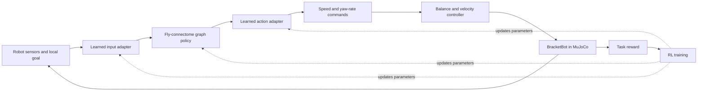

**Plan: train a fly-connectome controller for BracketBot**

Prepared 2026-09-12; updated during implementation. Scope: neuron/connectome control for BracketBot, with no fly-body reproduction. The user explicitly removed that requirement. A real FlyWire subset, robot RL environment, training pipeline, and synchronized demo recorder are now implemented. See `docs/brain_demo.md` for current commands and measured results; later milestones below remain research work.

The first result should be a BracketBot that reaches a goal and stops while maintaining balance, controlled by an RL-trained network built from fly connectivity. Compare it against a conventional policy on identical tasks. Whole-room cleanup comes later.

**What the linked work actually supplies**

| Resource | What it supplies | Role in our project |
| --- | --- | --- |
| [FlyBody](https://github.com/TuragaLab/flybody) | A MuJoCo fly body, locomotion tasks, and training tools | Background reference only; not installed or used as the robot environment |
| [2025 Nature paper](https://www.nature.com/articles/s41586-025-09029-4) | Artificial controllers trained for fly locomotion; a vision hierarchy reuses a fixed low-level flight controller | Inspiration for separating navigation decisions from stabilization |
| [FlyWire](https://www.nature.com/articles/s41586-024-07558-y) | A measured wiring diagram of 139,255 neurons and approximately 50 million chemical synapses | Candidate source of the actual brain connectivity |
| [FlyGM preprint, June 2026 revision](https://arxiv.org/html/2602.17997v3) | A graph controller based on whole-brain connectivity, trained through imitation and PPO for a simulated fly | Closest research precedent for the proposed controller |
| [FlyVis](https://github.com/TuragaLab/flyvis) | Released PyTorch models constrained by fly visual-system connectivity | Optional visual subsystem experiment; not a whole-brain controller |

FlyBody alone does not provide a reconstructed brain. Its locomotion weights do not provide a direct mapping to our wheels and arms. We propose transferring an architectural constraint and training approach to a different body, which remains an experiment.

FlyGM reports results on fly locomotion, not BracketBot. Its paper links a project site, but an official downloadable implementation and checkpoint were not verified during this review. Do not make the schedule depend on their availability. A custom implementation must be described as our adaptation, not a reproduced FlyGM result.

**Implementation scope after user clarification**

Use real neuron IDs, annotated coordinates, and measured connections from FlyWire FAFB v783 directly. Keep the BracketBot MuJoCo body. Do not install FlyBody or train a fly locomotion policy.

The robot uses a new PyTorch graph controller and PPO training pipeline. Its input/output mappings are engineered for this robot. The first pilot uses a disclosed 512-neuron induced subgraph. Full-source graph preparation is also supported; full-graph training is a separate scaling milestone.

The implementation uses a finite number of graph propagation rounds per action with no cross-step neural memory. It is a differentiable rate-like graph model, not a reproduction of a living fly's dynamics or a leaky integrate-and-fire simulation. This first version makes the topology experiment and real-time visualization tractable.

**Proposed control loop**

The connectome describes which computational units exchange signals. The adapters translate robot observations into those units and their outputs into robot commands. A wheel encoder has no established one-to-one biological counterpart here; those mappings are engineering choices that we document and learn.

The implemented pilot issues two normalized actions: desired forward speed and yaw rate, converted to m/s and rad/s with acceleration limits. Forward-speed control and stable turning are implemented. Hardware command expiry and limits based on measured hardware remain future work.

Target a 20 Hz decision loop and preserve the existing 500 Hz simulation/balance update: hold a command for 25 physics steps. These are starting design targets, subject to stability and latency measurements. A policy stall must return to controlled zero-speed balancing. This first architecture learns navigation; it does not establish that the graph itself learned to balance.

1. **Prepare isolated environments and pin the source data.**

   Keep the working robot environment intact and install the new PyTorch/Gymnasium dependencies in the project virtual environment. FlyBody is excluded. Its NumPy 1.26.4 / TensorFlow 2.8 pins would conflict with the current robot stack if added. [FlyBody dependency manifest](https://raw.githubusercontent.com/TuragaLab/flybody/main/pyproject.toml)

   Select a fixed FlyWire FAFB release, initially v783, and obtain connection tables, cell annotations, and available neurotransmitter predictions from the official download route. Record source URLs, release, checksums, filtering, and attribution. Current downloads may require an account/token; publication archives and current exports may differ. [FlyWire download guidance](https://codex.flywire.ai/faq)

   Gate: a reproducible robot environment, source manifest, and small graph forward/backward smoke test. Profile CPU, available GPU memory, simulation throughput, and inference latency. GPU capacity could not be verified from this session, so no full-graph hardware or cost commitment is justified yet.

2. **Create the robot RL environment and a conventional baseline.**

   Add a Gymnasium wrapper with seeded reset, normalized observations/actions, episode termination for falls and collisions, and distinct time-limit truncation. Hold arms in a tested stowed pose. Implement and test speed control before introducing obstacles.

   Begin with pitch/roll estimates, gyro, separate wheel speeds, estimated velocity, previous action, and a relative goal. Initially allow simulator pose for a clearly labeled privileged-state experiment. Before testing deployment readiness, replace that input with estimated odometry/localization; simulator truth remains available for rewards and scoring.

   Train an MLP PPO baseline on stop/go/turn and point-to-point goals. Use a recurrent conventional baseline when the graph retains memory so comparisons account for temporal information. SB3 supports custom policy networks, but its standard recurrent extension is LSTM-specific; arbitrary graph memory requires explicit policy and rollout-buffer integration. [SB3 custom policies](https://stable-baselines3.readthedocs.io/en/master/guide/custom_policy.html), [recurrent PPO interfaces](https://sb3-contrib.readthedocs.io/en/master/modules/ppo_recurrent.html)

   Gate: baseline reaches goals across randomized starts and commands with repeatable scores. If this fails, debug the environment/controller before drawing conclusions about the connectome.

3. **Implement the connectome architecture and robot adapters.**

   Build a directed sparse graph indexed by stable neuron IDs. Aggregate multiple synapses for a neuron pair, preserving a count/weight and any explicitly chosen sign convention. Report missing annotations and distinguish synapse counts from distinct graph edges. Never construct a dense whole-brain adjacency matrix.

   For our first implementation, keep connectivity fixed and train compact input/output adapters and shared node-update parameters. Check that the selected input nodes can influence the selected output nodes. Normalize signals to avoid unbounded recurrent activity; validate this empirically rather than assuming biological wiring guarantees stability. If signs are constrained, record the neurotransmitter-to-sign assumptions and treatment of uncertain cells.

   Benchmark small node-state widths, limited graph propagation steps, and batch sizes. Maintain independent graph state per environment and reset it at episode boundaries. Use sequence training with burn-in/recomputation as needed; a stateful graph cannot be treated as an ordinary feature extractor with randomly shuffled individual transitions.

   A reduced subgraph is acceptable to debug the pipeline, but must be labeled as reduced. The whole-brain target passes only when the selected complete release and all disclosed filtering are represented. If full-graph training is impractical, retain the full goal as outstanding and evaluate the reduced experiment separately.

4. **Teach robot behavior, then improve it with RL.**

   Collect successful BracketBot trajectories from the conventional policy or a tested waypoint controller. Match the teacher and student observation/action definitions. Fly walking demonstrations are inappropriate labels for wheel commands.

   First train the graph policy to imitate those robot actions. Then fine-tune with PPO, using a separate conventional critic and the same training conditions as the baseline. Frozen-graph adapters are an integration baseline; if the recurrent graph parameters remain frozen, report that only adapters were trained. For the main experiment, train the permitted internal parameters while preserving the chosen topology.

   Proposed navigation reward: progress toward the goal plus a stopped-at-goal success bonus, minus tilt, collision/fall, excessive command changes, effort, and elapsed-time penalties. Define progress from a fixed evaluation reference and check that reward cannot be exploited by oscillating, remaining still, or terminating early. Log each reward component independently.

   Curriculum: stationary stabilization under the low-level controller -> short straight goals -> turns and stopping -> obstacle-free random goals -> obstacles -> table docking. Introduce disturbances and physical randomization after basic learning works.

5. **Establish whether the fly wiring contributes anything.**

   Compare: existing low-level controller with the same waypoint teacher; conventional MLP/recurrent RL policy; connectome graph; and a degree-preserving rewired graph. For the graph control, keep update rules, input/output assignments, weight/sign distributions, training data, and optimization budget as comparable as possible. Also evaluate removing recurrent memory and freezing the internal graph.

   Use at least three training seeds for the pilot, preferably five for a stronger comparison, and held-out layouts, starts, goals, and disturbances. Report environment steps, wall time, success, falls/collisions, goal error, energy proxy, and inference latency. Similar parameter counts alone do not make computational budgets equal.

   Proposed pilot target: >=90% of 100 held-out goals reached within 10 cm, speed below 0.05 m/s for one second, and no fall/collision in each successful episode. Publish all failed episodes too. These thresholds are engineering targets, not source results. Claim an advantage only if controlled comparisons support it; useful behavior without an advantage is still a valid feasibility result.

6. **Add camera feedback, SLAM, and task integration.**

   Start with compact lidar/depth features and camera target measurements, then compare raw-image encoders if needed. Reuse our camera inspection tooling to validate visibility and timestamping. The existing close-up experiment found an 8 cm rendering near plane clipping the cube; use a documented sensing configuration and verify depth before training. The head camera's current direction misses nearby tabletop objects.

   SLAM supplies pose/map and a planner supplies local goals. For navigation experiments, the graph owns local speed/yaw commands; a Nav2 local controller must not issue competing wheel commands. Use an explicit selector to compare controllers.

   A VLA can select/manipulate objects through a separate arm interface once that stack exists. The first experiment keeps arms stowed. Later coordinate phases: navigate -> stop/dock -> VLA arm action -> navigate. Camera encoders and navigation RL do not automatically supply language understanding or reliable grasping.

7. **Test deeper motor control and hardware transfer separately.**

   If the graph navigation experiment succeeds, optionally test bounded torque residuals over the existing balancer, then direct wheel-torque control in simulation. These require new action definitions, rewards, teachers/baselines, and timing tests; do not attribute stabilization by the PD controller to learned balancing.

   Before hardware transfer, replace placeholder masses/motor limits with measurements and randomize friction, latency, sensor bias, payload, and actuator response over justified ranges. Verify behavior under dropped observations and stale commands. Begin with constrained low-speed trials and the existing stabilization/stop mechanisms. Retrain and validate independently when moving arms change the center of mass.

**Implementation units and outputs**

| Proposed change | Outputs |
| --- | --- |
| `src/rlbot/envs/navigation.py`, velocity-control extension | Reset/step/action contract and baseline environment |
| `scripts/train_rl.py`, `scripts/evaluate_rl.py`, `configs/rl/` | Reproducible PPO runs and evaluation reports |
| `scripts/prepare_connectome.py`, `configs/connectome/` | Source manifest, sparse graph, validation statistics |
| `src/rlbot/policies/connectome.py`, recurrent training integration | Graph policy, adapters, state handling, profiling report |
| `scripts/collect_demonstrations.py`, `scripts/train_imitation.py` | Robot demonstration dataset and imitation checkpoint |
| `scripts/record_demo.py`, `demo/` viewer | Synchronized robot video, camera views, actions, rewards, computed node activity, and replay controls |

Keep large datasets/checkpoints outside Git, with reproducible acquisition scripts. A checkpoint must include model parameters, graph identity, observation normalization, action scales, random seeds, and training configuration. Label visualized node activity as model activity; it is not measured activity of a living fly.

**Demo visualization requirement**

User reference: https://x.com/FanPu_Zeng/status/2098623661171495297 . The post's media could not be retrieved during planning. Exact appearance and features remain to be checked from a screenshot or uploaded clip; the following is our provisional design, not a description of that post.

| Panel | Proposed content |
| --- | --- |
| Robot | Large MuJoCo room view, target marker, path trail, and current action |
| Network | Rotatable 3D neuron view colored by computed policy activity, with selectable populations and a color legend |
| Robot vision | Selected head/wrist image, with target overlay only when supplied by perception |
| Status | Task, elapsed simulation time, speed, lean, success/collision state, and policy identity |
| Replay | Play/pause, speed, timeline scrub, and repeatable episode selection |

Use anatomical neuron coordinates from the matching source release when available. If we use a graph layout instead, label it schematic. Display a sampled subset or region aggregates at whole-brain scale, disclose that reduction, and draw only selected connections to keep the view readable. Define how vector-valued node states become a displayed scalar, such as activation norm, and hold the color scale fixed across comparisons. Do not label graph activations as biological spikes.

Record robot state, camera frames, policy outputs, selected node activity, reward components, and episode events against one simulation clock. Live viewing and recorded replay must use the same schema. Use a background telemetry consumer so rendering cannot stall stabilization. Profile the display with downsampled activity; full per-neuron histories may be impractical.

The first visualization milestone uses a recorded episode to validate synchronization and export. While only the conventional policy exists, display its identity and leave fly-network activity unavailable. Once the graph runs, connect its actual activations. Include a replayable successful episode and failure case, plus a side-by-side comparison only when both controllers have measured runs. No fly-body footage is required.

Completion check: scrubbing to a timestamp shows the matching robot pose, camera frame, action, and network state; missing samples are marked; replay reproduces the recorded events; demo recording works without interfering with the robot loop. Export a standalone video alongside the interactive viewer.

The first milestones are the speed-controlled Gymnasium robot environment with a conventional baseline, a real connectome pilot, a sparse-graph compute benchmark, and the recorded-demo viewer. Schedule full-graph RL only after learning correctness and resource needs are measured. A FlyVis visual-system experiment remains a possible smaller alternative, but would not satisfy whole-brain control.
