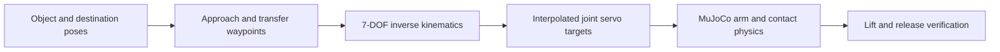

# Pick-and-place controller

The manipulation baseline drives the BracketBot arm. The arm picks up a cube,
moves it 17 cm along a table, releases it, and retreats. The base is fixed at
the table's docking pose. The cube stays a free body. Contact and friction must
hold it for the whole transfer.

The default build is the supplied hooked gripper with a contact pad on each
blade (`--gripper padded`). The CAD blades are untouched and are still the
visuals. The pads are what the simulator collides. Two other builds exist.
`--gripper urdf` is the supplied gripper with nothing added, and it does not
grasp. `--gripper parallel` is the sliding-jaw replacement that the earlier
results used. The pad dimensions and friction are prototype values, chosen so
this task works in simulation. No padding is fitted to the real robot. None of
this validates the hardware.

This is a scripted inverse-kinematics controller. The fly-connectivity driving
checkpoint does not control the arms. This sequence is not RL-trained. It
establishes the contact mechanics and demonstrations that a manipulation policy
needs first. The navigation RL results are a separate task.

The later [continuous arm RL experiment](arm_rl.md) has its own trainer,
checkpoint runner, and replay. Use that guide for learned arm motions. The
commands below reproduce the original scripted baseline.

## Run it

Run every command from the repository root, in the existing environment. Every
`out/...` path is generated locally and is not tracked in git.

1. Record the replay:

```bash
.venv/bin/python scripts/pick_place.py --record --open
```

This writes `out/pick_place/demo.gif`, an over-the-shoulder replay, plus
`episode.json` (trajectory data) and `report.json`. A recorded run ships as
[../demo/fly_brain_pick_place.gif](../demo/fly_brain_pick_place.gif).

2. Reopen the existing replay:

```bash
open out/pick_place/demo.gif
```

3. Watch the controller in a live MuJoCo window. The viewer needs `mjpython` on
macOS:

```bash
.venv/bin/mjpython scripts/pick_place.py --view
```

4. Evaluate headless over ten starting positions:

```bash
.venv/bin/python scripts/pick_place.py --episodes 10 --output out/pick_place_eval
```

Use `--item cube_s`, `cube_m`, `cube_l`, or `cube_xl` to select a cube. The
recorded tests used 42, 48, 54, and 58 mm cubes. The room now holds 56, 57,
58, and 57 mm cubes (`src/rlbot/room.py`), so a run today picks those sizes.
The task resets the selected cube at a common reachable pickup
location. It clears the other cubes from that table. The start position is
randomized by up to 8 mm in each horizontal axis.

## Controller and physics

The system reads the object pose from MuJoCo. It plans six end-effector poses:
above the cube, at the grasp, lifted, above the destination, lowered to place,
and withdrawn. Nine execution phases insert grasp, release, and verification
between those poses.



Each arm has one vertical rail and six revolute joints. The IK solver targets a
6D grip-site pose. It uses the positional and rotational site Jacobian with
damped least squares:

`dq = J.T @ solve(J @ J.T + damping**2 * I, pose_error)`

Solutions are clamped to joint limits. The first waypoint can use restarts.
Later waypoints continue from the preceding solution and reject large joint
jumps. Smooth ramps feed the position servos, and MuJoCo advances at 500 Hz. The
targets never overwrite the moving arm's joint positions.

The prototype gripper has two opposed slide joints. Displacement `q` on each jaw
gives an aperture of `2*q`, up to 100 mm. The jaw-center frame does not depend
on aperture. Opening is `(cube_width + 35 mm clearance)/2` per jaw. Closing asks
for zero displacement, and the drive stalls against contact. A joint equality
couples the follower to the driven jaw.

| Gripper parameter | Simulation value |
| --- | --- |
| Pad dimensions | 18 × 8 × 50 mm |
| Finger travel | 0–50 mm per jaw |
| Driven-jaw force limit | ±8 N |
| Position gain | 800 N/m |
| Servo damping | 8 N·s/m |
| Sliding-joint damping | 1 N·s/m |
| Sliding / torsional / rolling friction | 1.2 / 0.02 / 0.002 |
| Contact dimensions | 4 |
| Coupling time constant | 4 ms |

The visible pads, the stems, and the rail have collision geometry. The original
arm links, hand, and joint servos stay. The replacement is built in memory for
this task, and the robot and room XML files are never modified. These gripper
parameters are a prototype specification, not measured hardware values.

## Why the blades need pads

MuJoCo collides a mesh geom as a single convex body. Each hooked blade's convex
hull measures **147.5 cm3 against the mesh's own 46.1 cm3, a factor of 3.2**. So
the concave hook that the CAD depends on fills in solid. The blades then present
as fat wedges. Three independent runs agree:

| Check | Bare blades | With pads |
| --- | --- | --- |
| `check_grasp.py --item cube_m` | 0/1, rose -0.0 mm, empty | 1/1, rose +135.4 mm, holding |
| `pick_place.py` 48 mm cube | 0/5, max lift 1.5 mm, no two-finger contact | 5/5 |

The pads therefore replace the blade mesh as the colliding geometry. Each pad is
a 26 x 33 mm face, standing 6 mm proud of the blade it sits on. It uses sliding
friction 5.0 and a slightly soft contact, and is drawn in the blade's own
colour. The blade meshes stay as visuals and stop colliding. That is the one
real cost: the blades no longer collide with anything else, so they cannot bump
the table or another object.

Two further changes were needed. Both are in the controller, not the gripper:

- **Grip to the object's width, not shut.** These blades are a pincer. Fully
  closed, they scissor past each other and flick the object out. This was
  measured directly: the pads swapped sides and the cube escaped after a 1.9 mm
  lift. `PaddedGripper.grip_command` stops them 4 mm inside the object's faces
  and lets the force-limited servo press.
- **Aim the pads, not the blade tips.** `PaddedGripper` measures aperture
  between the pad faces, because the pads are now what touches.

Pad size was swept against all four cubes. A smaller face loses the 42 mm cube:
the blades grip it above its centre, and it rolls out during the carry. A larger
face fouls the 54 mm and 58 mm cubes on the way in. An earlier convex
decomposition attempt gave transient lifts without reliable transfer, and was
not kept.

## Success criteria

The supplied blades with pads pass **20/20**: five starts each at 42, 48, 54 and
58 mm. The same sweep with no pads passes 0/20.

The parallel-jaw variant (`--gripper parallel`) passed **25/25** episodes: ten
48 mm cube starts, and five each for the 42, 54, and 58 mm cubes. These are
small ±8 mm position variations near one docking pose. They are not a general
manipulation success rate. Final horizontal errors were 2.1–5.4 mm. The
displayed 48 mm run lifts 14.9 cm and releases 4.7 mm from the target, in an
18.5-second sequence. The results are in
[results/pick_place.json](results/pick_place.json).

A successful episode must satisfy all of these checks:

- The cube rises at least 8 cm above its starting height.
- Both fingers contact it for at least 0.5 seconds while it is raised over 5 cm.
- Its final horizontal position is within 3 cm of the destination.
- Its base returns within 8 mm of the tabletop, with speed below 2.5 cm/s.
- Neither finger touches it after release, and placement stays stable for at
  least 0.5 seconds during verification.

The green destination outline is display geometry only. It does not hold the
cube up. This task variant removes the other cubes on the same table to leave a
clear destination. The original room file is not edited. Object positions may be
assigned at episode reset. No object weld or pose assignment is used while the
pick-and-place sequence runs.

## How this connects to the fly-neuron controller

The existing neural controller has a 12-value navigation input. It has two
outputs: speed and turning. It cannot be reused as an arm policy. That needs new
input/output adapters and training on a manipulation task.

A manipulation version would keep the measured connectivity. It would replace
the observation adapter with joint state, gripper state, object and goal
relative poses, and contact information. It would output bounded end-effector
motion plus a gripper command. IK and servo control can stay below the learned
policy. Demonstrations from a reliable contact controller give the
initialization, and PPO then optimizes grasp retention and placement while
penalizing drops and collisions. It must be compared with the scripted baseline
and with an MLP over the same randomized tasks.

This rollout does not establish camera-based grasp detection, obstacle-aware arm
planning, balancing during manipulation, or a hardware-ready controller. Robot
self-collision stays filtered in the supplied model. The base must eventually be
released and controlled jointly with the arm. Validation with measured motor,
gripper, and contact parameters must follow.

The regression suite verifies four things: a free object with no weld, the
explicit gripper substitution, a complete successful transfer and release, and
failure with grip force disabled. The navigation and graph regressions pass
too:

```bash
.venv/bin/python -m unittest discover -s tests -v
```
