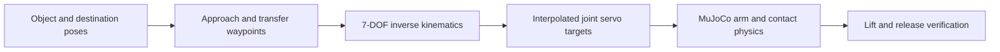

# Pick-and-place controller

The manipulation baseline uses the BracketBot arm with an explicit **parallel-jaw
gripper replacement** to pick up a cube, move it 17 cm along a table, release it,
and retreat. The base is fixed at the table's docking pose. The object remains a
free body: contact and friction must support it throughout the transfer. The
supplied hooked gripper did not complete this task; this result does not validate
that original gripper model or the corresponding hardware.

This is a scripted inverse-kinematics controller. **The fly-connectivity driving
checkpoint does not control the arms, and this sequence is not RL-trained.** It
establishes the contact mechanics and demonstrations needed before training a
manipulation policy. The earlier navigation RL results remain a separate task.

The subsequent [continuous arm RL experiment](arm_rl.md) has its own trainer,
checkpoint runner, and replay. Use that guide for learned arm motions; the
commands below deliberately reproduce the original scripted baseline.

## Run it

From the repository root in PowerShell, using the existing environment:

```powershell
.venv\Scripts\python.exe scripts/pick_place.py --record --open
```

This creates `out/pick_place/index.html`, a synchronized overview/close-up replay,
plus a GIF, trajectory data, and a JSON report. To reopen the existing replay:

```powershell
Start-Process .\out\pick_place\index.html
```

To watch the controller execute in a live MuJoCo window:

```powershell
.venv\Scripts\python.exe scripts/pick_place.py --view
```

On macOS use `.venv/bin/mjpython` for the live viewer. For a headless evaluation
over ten starting positions:

```powershell
.venv\Scripts\python.exe scripts/pick_place.py --episodes 10 --output out/pick_place_eval
```

Use `--item cube_s`, `cube_m`, `cube_l`, or `cube_xl` to select 42, 48, 54, or
58 mm cubes respectively. The task resets the selected cube at a common reachable
pickup location and clears the other cubes from that table. Starting position is
randomized by up to 8 mm in each horizontal axis.

## Controller and physics

The system reads the object pose from MuJoCo. It plans six end-effector poses:
above the cube, at the grasp, lifted, above the destination, lowered to place,
and withdrawn. Nine execution phases insert grasp, release, and verification
between those poses.



Each arm has one vertical rail and six revolute joints. The IK solver targets a
6D grip-site pose, using the positional and rotational site Jacobian and damped
least squares:

`dq = J.T @ solve(J @ J.T + damping**2 * I, pose_error)`

Solutions are clamped to joint limits. The first waypoint can use restarts;
subsequent waypoints continue from the preceding solution, rejecting large
joint jumps. Smooth ramps feed position servos, and MuJoCo advances at 500 Hz.
Those targets do not directly overwrite the moving arm's joint positions.

The prototype gripper has two opposed slide joints. With displacement `q` on
each jaw, aperture is `2*q`, up to 100 mm. The jaw-center frame is independent
of aperture. Opening is `(cube_width + 35 mm clearance)/2` per jaw; closing asks
for zero displacement and the drive stalls against contact. A joint equality
couples the follower to the driven jaw.

| Gripper parameter | Simulation value |
| --- | --- |
| Pad dimensions | 18 × 8 × 50 mm |
| Finger travel | 0–50 mm per jaw |
| Driven-jaw force limit | ±8 N |
| Position gain | 800 N/m |
| Servo damping | 8 N·s/m |
| Sliding-joint damping | 1 N·s/m |
| Sliding / torsional / rolling friction | 1.2 / 0.02 / 0.002 |
| Contact dimensions | 4 |
| Coupling time constant | 4 ms |

Visible pads, stems, and the rail have collision geometry. The original arm
links, hand, and joint servos remain. The replacement is constructed in memory
for this task; the original robot and room XML files are not modified. These
gripper parameters are a prototype specification, not measured hardware values.

The original mesh gripper failed the initial cube test. Convex decomposition,
force changes, and pad experiments yielded transient lifts but did not establish
reliable transfer. The working result therefore uses the clearly identified
parallel-jaw variant instead of claiming those changes fixed the supplied jaws.

## Success criteria

The measured set passed **25/25** episodes: ten 48 mm cube starts, and five each
for 42, 54, and 58 mm cubes. Those are small ±8 mm position variations near one
docking pose, not a general manipulation success rate. Final horizontal errors
were 2.1–5.4 mm. The displayed 48 mm run lifts 14.9 cm and releases 4.7 mm from
the target in an 18.5-second sequence. Results are in
[results/pick_place.json](results/pick_place.json).

A successful episode must satisfy all of these checks:

- The cube rises at least 8 cm above its starting height.
- Both fingers contact it for at least 0.5 seconds while it is raised over 5 cm.
- Its final horizontal position is within 3 cm of the destination.
- Its base returns within 8 mm of the tabletop, with speed below 2.5 cm/s.
- Neither finger is touching it after release, and placement remains stable for
  at least 0.5 seconds during verification.

The green destination outline is display geometry only. It does not hold the
cube up. Other cubes on the same table are removed in this task variant to leave
a clear destination; the original room file is not edited. Object positions may
be assigned at episode reset, but no object weld or pose assignment is used
while executing the pick-and-place sequence.

## How this connects to the fly-neuron controller

The existing neural controller has a 12-value navigation input and two outputs:
speed and turning. It cannot be reused as an arm policy without changing its
input/output adapters and training on a manipulation task.

A manipulation version would retain the measured connectivity, replace the
observation adapter with joint state, gripper state, object/goal relative poses,
and contact information, and output bounded end-effector motion plus a gripper
command. IK/servo control can remain below the learned policy. Demonstrations
from a reliable contact controller provide initialization; PPO then optimizes
grasp retention and placement while penalizing drops and collisions. It must be
compared with the scripted baseline and an MLP over the same randomized tasks.

This rollout does not establish camera-based grasp detection, obstacle-aware arm
planning, balancing during manipulation, or a hardware-ready controller. Robot
self-collision remains filtered in the supplied model. The base must eventually
be released and controlled jointly with arm motion, followed by validation with
measured motor, gripper, and contact parameters.

The regression suite verifies a free object with no weld, the explicit gripper
substitution, a complete successful transfer/release, and failure with grip
force disabled. Existing navigation/graph regressions also pass:

```powershell
.venv\Scripts\python.exe -m unittest discover -s tests -v
```
